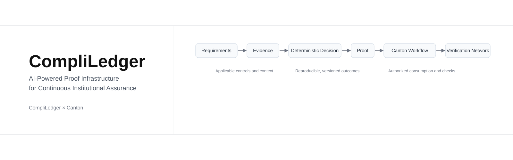
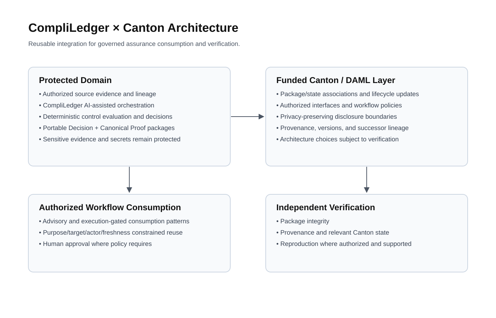
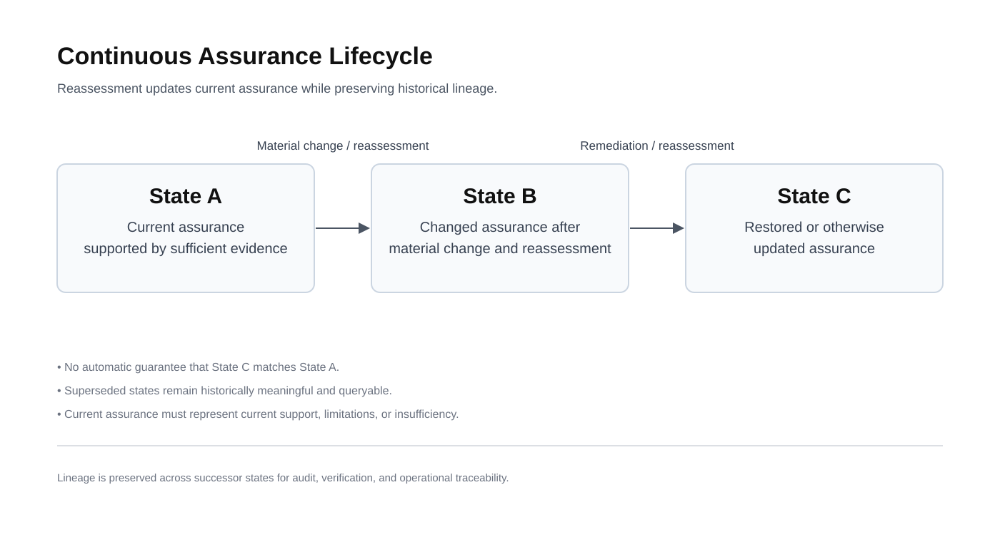
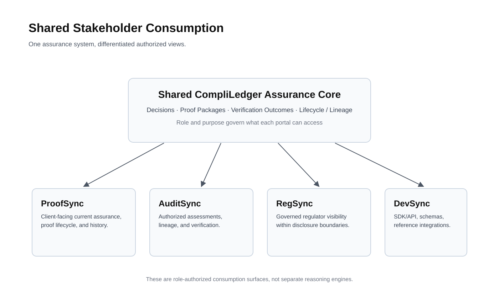

  

<h1 align="center">CompliLedger × Canton</h1>

<strong>AI-Native Compliance and Governance Infrastructure for Banks and Financial Institutions</strong>

Institutional assurance that converts requirements, context, and evidence into deterministic decisions, portable proof, and continuously updated assurance for authorized Canton workflows.

<strong>$385,000 Funding Request</strong> · <strong>7 Milestones</strong> · <strong>~9 Months to Accepted Production Launch</strong> · <strong>6 Months Post-Launch Maintenance &amp; Adoption</strong>

<a href="../compliledger.md"><strong>Read the Full Canonical Proposal</strong></a>

---

## Navigation

- [Executive opening](#executive-opening)
- [Continuous assurance lifecycle](#continuous-assurance-lifecycle)
- [Canton integration architecture](#canton-integration-architecture)
- [Stakeholder consumption model](#stakeholder-consumption-model)
- [Funding and milestone links](#funding-and-milestone-links)

## Executive opening

Institutional financial workflows are becoming digital, tokenized, programmable, and multi-party while assurance remains largely manual, fragmented, and periodic. CompliLedger addresses this gap by combining AI-assisted orchestration with deterministic evaluation so consequential decisions remain reproducible, bounded, and verifiable.

This funded work does **not** claim to reinvent CompliLedger or replace Canton. It delivers the reusable Canton-native integration layer that enables authorized participants to consume current assurance decisions, proof packages, lifecycle state, and verification outcomes in workflow context.

  

## Continuous assurance lifecycle

The assurance model is lifecycle-aware. It preserves history while requiring reassessment when material conditions change.

- **State A:** Current assurance is supported by sufficient, validated evidence.
- **Material change:** Evidence freshness, operational conditions, policy versions, authority, or other relevant state changes.
- **State B:** Assurance is updated; prior state is no longer represented as current.
- **Remediation + reassessment:** New evidence triggers further deterministic evaluation.
- **State C:** Assurance is restored **or otherwise updated** based on current support.

This model explicitly avoids guaranteed restoration assumptions and keeps successor lineage intact.

  

## Canton integration architecture

The funded Canton layer centers on reusable integration, not disclosure of raw sensitive evidence.

- **Protected domain:** Sensitive evidence, credentials/secrets, and proprietary reasoning remain in protected systems.
- **CompliLedger intelligence:** AI-assisted interpretation/orchestration plus deterministic control evaluation produce structured decisions.
- **Funded Canton layer:** DAML/Canton packages, state, interfaces, privacy/authorization patterns, and lifecycle-aware proof association.
- **Workflow + verification:** Authorized parties consume decisions/proof in workflow and perform independent verification at supported levels.
- **Verification boundary:** Exact architecture choices and supported patterns remain subject to Canton-native technical verification.

## Stakeholder consumption model

All four portals consume the **same** shared assurance lifecycle and decision/proof infrastructure with role-based access.

- **ProofSync:** Client-facing assurance and proof visibility.
- **AuditSync:** Auditor access to authorized assessments, lineage, and verification.
- **RegSync:** Regulator access within approved disclosure boundaries.
- **DevSync:** Developer access to SDK/API, schemas, references, and verification integration.

The model is governed reuse—not four independent reasoning systems.

  

## Funding and milestone links

- **Total funding request:** **$385,000 USD** (denominated in fixed Canton Coin under approved methodology)
- **Program horizon:** approximately 15 months total (about 9 months to accepted production launch + 6 months maintenance/adoption)
- **Milestones:** 7 total, including post-launch maintenance/adoption deliverables

Direct canonical sections:

- [Funding](../compliledger.md#funding)
- [Milestones and Deliverables](../compliledger.md#milestones-and-deliverables)
- [Acceptance Criteria](../compliledger.md#acceptance-criteria)
- [Architectural Alignment](../compliledger.md#architectural-alignment)

---

### Scope note

This README is an executive gateway. The canonical authority for scope, acceptance, architecture, funding mechanics, and constraints is [`proposals/compliledger.md`](../compliledger.md).
