<h1 align="center">CompliLedger × Canton</h1>

  <strong>AI-Powered Proof Infrastructure for Continuous Institutional Assurance</strong>

Transforming requirements, evidence, context, and operational state into deterministic decisions, portable proof, and continuously updated assurance for institutional Canton workflows.

<strong>$385K Funding Request</strong> · <strong>7 Milestones</strong> · <strong>~9 Months to Production</strong> · <strong>6 Months Post-Launch Support</strong>

### [Read the Full Canton Development Fund Proposal →](../compliledger.md)

The canonical proposal contains the complete technical architecture, milestones, acceptance criteria, funding mechanics, maintenance commitments, and scope boundaries.

## Executive Thesis

| Institutional Assurance Today | CompliLedger |
|---|---|
| Manual | **AI-Native** |
| Periodic | **Continuous** |
| Point-in-Time | **Real-Time / Near-Real-Time** |
| Audit Prep | **Audit-Ready** |
| Reports | **Machine-Verifiable Proof** |
| One-Time Assurance | **Reusable Continuous Operational Assurance** |

> **Canton enables financial value to move through privacy-preserving institutional workflows. CompliLedger enables the assurance behind that value to be continuously evaluated, proven, independently verified, and consumed alongside it.**

## The Opportunity

| The Problem | The Infrastructure | The Outcome |
|---|---|---|
| Institutional assurance remains manual, fragmented, periodic, and repeatedly reconstructed. | CompliLedger transforms requirements + target + context + operational state into deterministic assurance and proof. | Canton participants gain reusable continuous-assurance infrastructure for institutional financial workflows. |

Financial infrastructure is becoming digital, tokenized, programmable, interconnected, and increasingly automated, while assurance remains largely point-in-time.

CompliLedger changes assurance from a report about a prior condition into a maintained operational state that can respond when evidence, requirements, authority, or operational conditions materially change.

## From Requirement to Verifiable Assurance

```mermaid
flowchart LR
    A[Requirements] --> B[Target + Context]
    B --> C[Applicability]
    C --> D[Applicable Controls]
    D --> E[Evidence]
    E --> F[Evidence Sufficiency]
    F --> G[Deterministic Evaluation]
    G --> H[Decision]
    H --> I[Portable Decision Package]
    I --> J[Canonical Proof Package]
    J --> K[Canton]
    K --> L[Independent Verification]
    L --> M[Continuous Assurance]
    M -. Material Change .-> E
```

